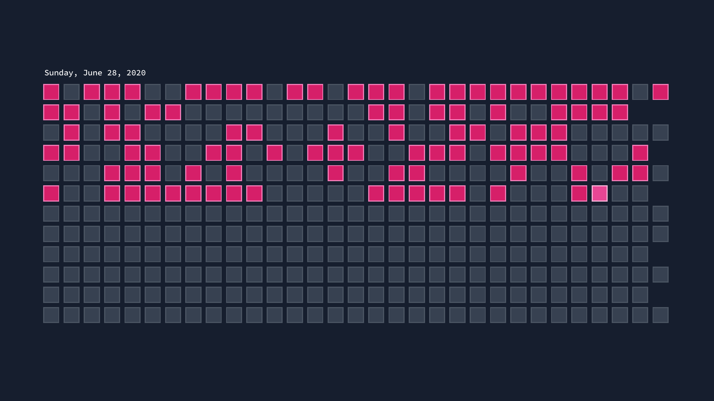

# MotivationTracker
Simple application to track days working on something.

## Description

The idea is based on the [The Every Day Calendar](https://www.kickstarter.com/projects/simonegiertz/the-every-day-calendar). The purpose is to make it easier to keep track of a specific goal. You can visualize the whole year and watch your progress throughout.

## Controls

* Each square is a day in the year. Click on a day to highlight it.
* Save with `CTRL + S`. A screenshot will be created next to the binary.

## Release

Find the builds on [apos.itch.io/motivationtracker](https://apos.itch.io/motivationtracker).
